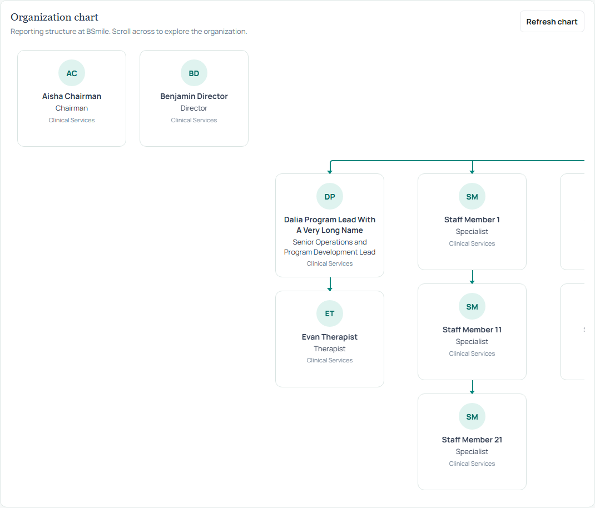
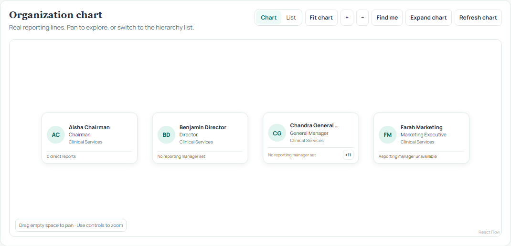
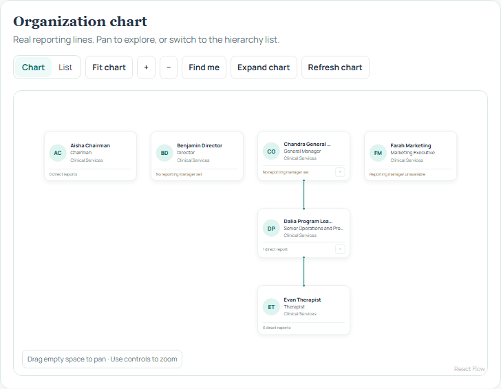
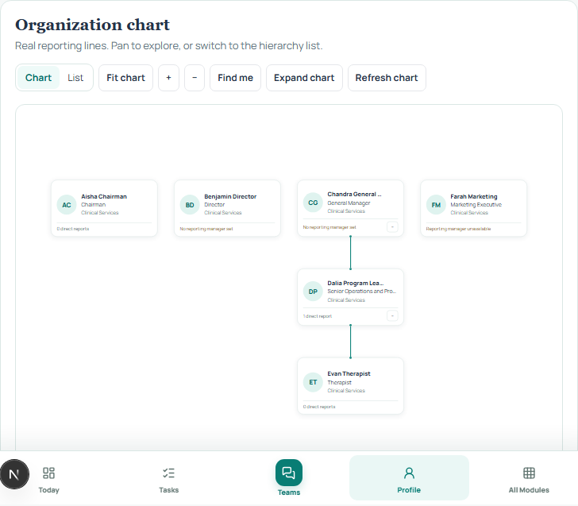
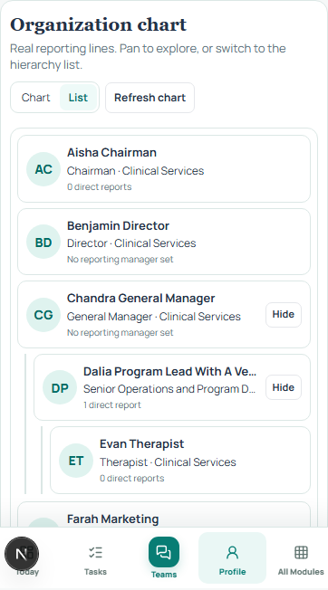
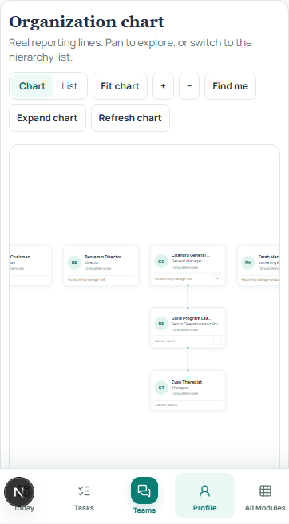

# Organization chart visual review

These screenshots use the same synthetic 31-person directory in a QA browser session. They contain no Production employee records. The base is `6c268ee2b831ab041cd5aa222ee5362213188193`. All captures are Chromium browser emulation, not real-device screenshots. The same responsive and interaction test also passed in Playwright WebKit.

## Desktop, 1366 × 768

Before: the original nested flex renderer uses fixed-width columns and horizontal scrolling. The initial viewport exposes only a fragment of this wide team.

After: the layout engine keeps the four legitimate roots separate and initially collapses a large branch into a readable overview. Expand the `+11` branch to see its reports.

## Tablet

## Mobile, 390 × 844

The accessible hierarchy list is the initial view. The chart remains available as a pannable alternate view.

